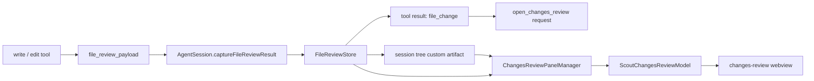

# Changes Review Diff Implementation

本文记录当前未提交代码中“审查 diff”（Changes Review / Scout Diff）的实现方式。它不是单纯在聊天里展示一段补丁文本，而是把工具写文件时产生的变更捕获为结构化数据，在运行态生成 diff，在会话树里持久化轻量 artifact，并通过独立 webview 面板展示 unified / split diff。

## 目标与边界

Changes Review 的目标是：

- 让 `write` / `edit` 工具产生的文件修改可以被用户按文件审查。
- 聊天记录里只保存轻量 `file_change` 结果，避免把完整文件内容塞进 tool result。
- 完整 diff 内容先存在 extension runtime，随后压缩为 session tree artifact，支持恢复历史会话后继续打开审查面板。
- webview 只消费 `@scout-agent/shared` 中定义的协议模型，不直接读取 extension / agent 内部类型。

它刻意区分三种数据形态：

- **runtime review**：当前 agent run 内的完整变更内容，包含原文、修改后文本和可重新计算 diff 的数据。
- **file review artifact**：写入 session tree 的持久化快照，保留折叠后的 diff rows、统计信息和必要指纹。
- **webview model**：面向 `changes-review` surface 的渲染模型，只包含展示所需字段、当前 view mode 和可打开文件路径。



## 1. 工具层捕获文件修改

文件修改的第一手数据在 extension core 的工具层捕获：

- `packages/extension/src/core/tools/write.ts`
- `packages/extension/src/core/tools/edit.ts`

工具执行完成后不会直接返回完整 diff，而是返回内部专用的 `file_review_payload`：

```ts
{
  kind: "file_review_payload",
  operation: "write" | "edit",
  path,
  absolutePath,
  originalContent,
  modifiedContent,
  unavailableReason,
}
```

### write 工具

`write` 在写入前尝试读取目标文件的旧内容：

- 文件不存在时，`originalContent` 为 `null`，表示新增文件。
- 文件超过 `MAX_REVIEW_TEXT_BYTES` 时，不读取旧内容，直接标记不可审查。
- 文件不是有效 UTF-8 或疑似二进制时，通过 `decodeReviewContent` 返回 `unavailableReason`。
- 只有旧内容可审查时，才把本次写入文本作为 `modifiedContent` 放进 payload。

这样可以避免为了审查 diff 读取超大文件，也避免把二进制文件误当文本 diff。

### edit 工具

`edit` 必须读取原文件才能应用替换，因此它先拿到原始 buffer：

- 审查侧使用 `decodeReviewContent(buffer)` 判断是否适合展示。
- 实际编辑逻辑仍然基于 UTF-8 字符串应用替换。
- 如果审查解码失败，工具仍可完成编辑，但 review payload 会标记不可审查。

这让“工具能否修改文件”和“diff 是否适合展示”解耦，避免审查能力反向影响正常编辑路径。

## 2. AgentSession 捕获并转成轻量结果

`packages/extension/src/core/agent-session.ts` 负责把工具 payload 接入 review runtime。

核心状态：

- `currentReviewRunId`：每次 assistant run 开始时刷新，用于把同一轮工具调用归到同一个 review turn。
- `fileReviewStore`：运行态 review 存储，保存完整文本内容和按文件聚合后的 diff 元信息。

关键流程：

1. `agent_start` 触发 `startFileReviewRun()`，生成新的 review run id。
2. 每次工具调用结束后，`handleAfterToolCall()` 调用 `captureFileReviewResult()`。
3. 只有成功工具调用且 `details.kind === "file_review_payload"` 时才捕获。
4. `FileReviewStore.addRecord()` 写入完整运行态数据。
5. `captureFileReviewPayload()` 返回轻量 `ScoutFileChangeDetails` 给聊天 tool result。
6. `emitFileReviewUpdated(turnId)` 通知 host 层可以异步保存 artifact。

聊天中保留的 `file_change` 形态大致是：

```ts
{
  kind: "file_change",
  path,
  additions,
  deletions,
  firstChangedLine,
  review: {
    turnId,
    recordId,
  },
}
```

这个设计有两个好处：

- 聊天消息只承载可以展示入口和统计的信息，不保存完整文件内容。
- 打开审查面板时可以通过 `turnId` / `recordId` 回到 runtime review 或 artifact。

## 3. FileReviewStore 的聚合语义

`packages/extension/src/core/review/file-review.ts` 是 review diff 的核心。

### 按 turn 与文件聚合

`FileReviewStore` 使用 review turn 作为顶层分组，同一 turn 内再按文件 path 聚合：

- 每个工具调用生成一个 `recordId`，例如 `review-1`。
- 同一文件多次修改时，保留第一次修改前的 `originalContent`。
- 后续修改只更新该文件的 `modifiedContent`。
- `recordIds` 记录这个文件在本轮中被哪些工具调用修改过。
- `latestSequence` / `latestRecordId` 用于排序和定位最新变更。

因此一轮 agent run 内，如果同一个文件被连续 edit 多次，面板展示的是“本轮开始前”到“本轮结束后”的最终 diff，而不是把每次中间补丁都单独展示。

### content release

完整文本内容只在 runtime 中短期保留。artifact 写入 session tree 后，host 会调用：

```ts
releaseFileReviewTurnContent(turnId)
```

释放后的 turn 会保留统计、record、文件列表等轻量数据，但不再持有 `originalContent` / `modifiedContent`。同时 store 只保留有限数量的已释放 turn，避免长时间会话中内存持续增长。

## 4. Diff 计算模型

diff 计算入口是 `computeReviewDiff(originalContent, modifiedContent, options)`。

它先做几层防线：

1. 如果工具层已经给出 `unavailableReason`，直接返回不可审查结果。
2. 如果原文和修改后文本完全相同，直接返回空 diff。
3. 如果内容总量超过 `MAX_REVIEW_TEXT_BYTES`，返回不可审查结果并尽量给出估算统计。
4. 将 CRLF / CR 归一化为 LF，再次判断是否无变化。
5. 调用 `buildDiffRows()` 生成结构化 rows。
6. 如果 rows 超过 `MAX_REVIEW_DIFF_ROWS`，返回不可审查结果。
7. 根据调用方需求决定是否折叠上下文。

### 行级 diff

`buildDiffRows()` 使用 `Diff.diffLines` 生成行级变更。输出 row 类型由 shared 协议定义：

- `context`：未变化行。
- `added`：新增行。
- `removed`：删除行。
- `fold`：折叠的上下文块。

每个 row 都带旧行号 / 新行号，便于 unified 和 split 两种展示模式使用同一份模型。

### 行内 diff

当一段 removed 紧跟一段 added 时，系统会尝试做行内 diff：

- 先用文件扩展名判断语法高亮语言。
- 通过 `lowlight` 生成语法 token。
- 使用词级 diff 标记行内 added / removed range。
- 将语法 token 和行内 diff 标记合并成 `ScoutChangesReviewToken[]`。

最终 webview 渲染时不需要再解析代码语法，只需要按 token class 输出 span。

### 上下文折叠

`collapseUnchangedRows()` 会保留变更附近的少量上下文行，其余连续未变化行变成 `fold` row。

默认上下文行数是 `REVIEW_CONTEXT_LINES = 3`。折叠 row 会记录：

- `count`：隐藏了多少行。
- `oldStartLine` / `newStartLine`：隐藏区域的起始行号。

artifact 持久化时默认只保存 fold row，不保存所有隐藏行；打开面板时再按条件补充可展开上下文。

## 5. Artifact 持久化

artifact 逻辑在：

- `packages/extension/src/host/review/file-review-artifact.ts`
- `packages/extension/src/host/session-coordinator.ts`

`AgentSession` 捕获到 review 更新后，会通过 `onFileReviewUpdated` 通知 host。`SessionCoordinator` 之后按 session + turn 做 debounce，并把 review 转为 session tree custom entry。

custom entry 类型：

```ts
scout.file_review_artifact
```

artifact 保存的信息包括：

- `sessionId`
- `turnId`
- `createdAt`
- `records`
- `files`
- 每个文件的 additions / deletions / unavailableReason
- 折叠后的 diff rows
- 修改后内容的 fingerprint

fingerprint 由修改后文本的 size 和 sha256 组成。它不是用来做安全校验，而是用来判断当前磁盘文件是否仍等于 artifact 当时的修改后内容，从而决定能否补全 fold 里的隐藏上下文。

### artifact 大小控制

持久化前会经过 `prepareFileReviewArtifactForSession()`：

- 文件数最多 `MAX_REVIEW_ARTIFACT_FILES = 100`。
- JSON 最大约 `MAX_REVIEW_ARTIFACT_BYTES = 2 * 1024 * 1024`。
- 总 row 数最多 `MAX_REVIEW_ARTIFACT_ROWS = 20_000`。
- 超出时优先裁剪过大的文件 rows。
- 仍然过大时去掉 token。
- 再过大时折叠所有 rows。
- 最后仍然过大才丢弃溢出的文件。

这套降级顺序优先保住“哪些文件变了”和“基础统计”，其次才保留完整视觉细节。

### 当前分支 artifact 收集

host 在打开历史审查时会从 session tree 中收集 artifact：

- `collectFileReviewArtifacts(entries)` 扫描所有 custom artifact。
- `collectCurrentBranchFileReviewArtifacts(entries, branchEntries)` 只保留当前分支可达的 artifact，以及必要的 metadata 后代。

这样恢复会话或切换分支时，面板打开的是当前会话分支语义下可见的 review。

## 6. 打开审查面板

聊天侧不会直接打开 webview。它通过 shared request 协议发起：

```ts
{
  type: "open_changes_review",
  turnId,
  recordId,
}
```

协议定义在：

- `packages/shared/src/protocol-requests.ts`
- `packages/shared/src/protocol-results.ts`
- `packages/shared/src/protocol-state.ts`

host 的 UI service 处理流程：

1. 优先用 `turnId` 查找已持久化 artifact。
2. 如果 artifact 不存在，再尝试读取 runtime review。
3. 如果 runtime review 已 `contentReleased` 且没有 artifact，则返回不可打开错误。
4. 如果传入 `recordId`，校验它属于当前 review records。
5. 调用 `openChangesReviewPanelCallback(review, options)` 打开独立 panel。

这个顺序保证历史会话优先走持久 artifact，而刚产生、尚未落盘的 review 仍可从 runtime 打开。

## 7. Host panel model

`packages/extension/src/host/review/changes-review-panel.ts` 负责把 runtime review 或 artifact 转成 webview model。

主要步骤：

1. 创建或复用 VS Code webview panel。
2. 读取用户上次选择的 view mode：`unified` 或 `split`。
3. 为每个 review file 生成 `ScoutChangesReviewFile`。
4. 计算总 additions / deletions。
5. 注入 bootstrap 数据 `window.__SCOUT_CHANGES_REVIEW__`。
6. 如果同一个 panel 已打开且 model signature 未变化，只发送 `scroll_to_record`。

### runtime review 路径

runtime review 仍持有完整文本时，panel 直接重新计算 collapsed diff：

```ts
computeReviewDiff(originalContent, modifiedContent, {
  collapseContext: true,
  filePath,
  unavailableReason,
})
```

然后调用 `hydrateFoldRowsFromContent()` 给 fold row 附带有限 hidden rows，使用户可以在 webview 中展开上下文。

### artifact 路径

artifact 已经带有折叠后的 rows。panel 会：

- 验证 artifact rows。
- 对缺失 token 的 row 补语法 token。
- 如果允许当前文件上下文扩展，则尝试读取磁盘上的当前文件。
- 用 fingerprint 确认当前文件与 artifact 的修改后内容一致。
- 一致时，按 fold 起始行号补全 hidden rows。

如果当前文件已经继续被用户或 agent 修改，fingerprint 不匹配，面板仍展示 artifact 中保存的 collapsed diff，但不会补全隐藏上下文。

### panel signature

panel manager 会计算一个 model signature，包含：

- render version
- turnId
- viewMode
- 文件路径、统计、状态
- rows 数量、fold 信息、token 信息

signature 没变时不重载 HTML，只滚动到目标 record。这样可以减少 webview 重建和 UI 闪烁。

## 8. Shared review protocol

webview 使用的模型都在 `packages/shared/src/protocol-review.ts` 中定义。

关键类型：

- `ScoutChangesReviewViewMode = "unified" | "split"`
- `ScoutChangesReviewToken`
- `ScoutChangesReviewDiffRow`
- `ScoutChangesReviewFile`
- `ScoutChangesReviewModel`
- `ScoutChangesReviewWebviewMessage`

webview 到 extension 的消息是 panel 内部消息，不走聊天 webview 的 request envelope：

- `set_changes_review_view_mode`
- `open_changes_review_file`

这是因为 Changes Review 是独立 webview panel，它的生命周期和主 chat surface 不同，但数据契约仍然放在 shared 层，避免 host / webview 私有类型互相泄露。

## 9. Webview 渲染

相关文件：

- `packages/webview/src/surfaces/changes-review/ChangesReviewApp.tsx`
- `packages/webview/src/surfaces/changes-review/ChangesReviewPanel.tsx`
- `packages/webview/src/surfaces/changes-review/ReviewFileSection.tsx`
- `packages/webview/src/surfaces/changes-review/ReviewDiff.tsx`
- `packages/webview/src/surfaces/changes-review/split-diff-model.ts`

### 应用状态

`ChangesReviewApp` 从 bootstrap 数据读取初始 model，并在 webview 内维护轻量 UI 状态：

- 当前 view mode。
- 哪些文件 section 展开。
- 每个 fold 已 reveal 多少隐藏行。

view mode 改变会通过 `set_changes_review_view_mode` 发回 extension，写入 `globalState`，下次打开沿用。

### unified diff

unified 模式直接按 rows 顺序渲染：

- context / added / removed row 一行对应一行。
- fold row 渲染为可展开的折叠条。
- fold 展开时显示 hidden rows 的上半段和下半段，逐步增加 reveal count。

### split diff

split 模式先调用 `createSplitDiffModel()`：

- context row 同时投影到左右两列。
- removed row 放左列。
- added row 放右列。
- removed / added run 长度不一致时插入 buffer cell 对齐。
- fold row 同时显示在左右两列。

split 表格有单独的横向滚动同步逻辑，避免左右代码列宽度较大时滚动状态不一致。

## 10. 性能与防御边界

当前实现的性能防线主要分布在四层。

### 工具捕获层

- 超过 `MAX_REVIEW_TEXT_BYTES` 的文件不读取或不展示完整 review。
- 二进制 / 非 UTF-8 文件直接标记不可审查。
- 文件不存在按新增文件处理，不把异常当失败 review。

### diff 计算层

- 完全相同内容先短路。
- 换行归一化后相同再次短路，避免 CRLF 造成噪声 diff。
- diff rows 超过 `MAX_REVIEW_DIFF_ROWS` 时降级为不可审查。
- 行内 diff 只对 removed + added 成对 run 计算，避免对纯新增或纯删除做额外工作。

### artifact 层

- 限制文件数、JSON 字节数和总 row 数。
- 按“裁 rows、去 token、全折叠、丢文件”的顺序逐步降级。
- 持久化后释放 runtime 原文，控制内存占用。

### panel / webview 层

- artifact hidden context 只在 fingerprint 匹配时从当前文件补全。
- hidden rows 有数量、字节数和 token 数预算。
- panel signature 未变化时不重建 webview。
- fold 展开在 webview 内逐步 reveal，不需要每次展开都回到 extension。

这些防线使常规小文件 diff 可以完整展示，大文件或极端 diff 会降级为统计和状态说明，而不是让 extension 或 webview 承担无界文本处理。

## 11. 测试覆盖地图

当前实现对应的测试大致按职责分布：

- `packages/extension/test/core/file-review.test.ts`
  - review store 聚合。
  - 大文件 / 二进制 / 换行归一化。
  - diff rows 与 token 基础行为。
- `packages/extension/test/host/review/file-review-artifact.test.ts`
  - artifact 创建。
  - artifact 大小限制和降级。
  - 当前分支 artifact 收集。
- `packages/extension/test/host/review/changes-review-panel.test.ts`
  - runtime / artifact 转 panel model。
  - fold hidden context hydration。
  - fingerprint 与当前文件读取保护。
- `packages/webview/test/changes-review/split-diff-model.test.ts`
  - split diff 投影。
  - added / removed run 对齐。
  - fold reveal 投影。
- shared protocol 相关测试覆盖 `open_changes_review` 请求和 `file_change` 结果契约。

## 12. 分层判断

当前实现基本遵循 Scout / Pi 的分层要求：

- `extension/core/tools` 只负责捕获工具执行产生的原始文件变化。
- `extension/core/agent-session` 负责 runtime review 的生命周期和 tool result 降级。
- `extension/core/review` 负责 diff、token、store 等 core 能力，不感知 VS Code webview。
- `extension/host` 负责 artifact 持久化、当前分支解析、panel 打开和文件系统补全上下文。
- `shared` 定义跨 extension / webview 的稳定协议。
- `webview` 只消费 shared review model 并发送 shared panel message。

比较关键的职责边界是：完整文件内容不进入 shared 协议和聊天消息；UI 展示状态不下沉到 agent harness；session tree 中持久化的是 review artifact，而不是 host/webview 的临时交互状态。
