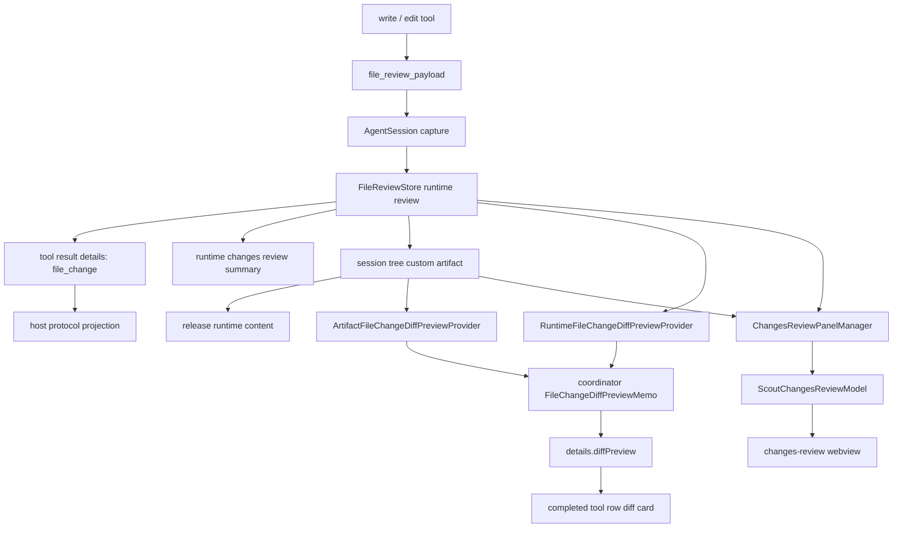

# Changes Review Diff 当前实现

本文记录 Scout 当前“文件变更审查 diff”的实现。它包含两种互补体验：

- 聊天里的 `write` / `edit` tool row：运行中显示轻量的动态 add/remove 预览，工具结束后把最终 `diffPreview` 附到 `file_change` details，允许“已编辑”行展开一个小 diff 卡片。
- 独立 Changes Review panel：通过 `turnId` / `recordId` 打开完整审查视图，支持 unified / split diff、折叠上下文、历史恢复和 artifact fallback。

核心边界是：完整文件内容不进入 shared 协议和聊天消息；webview 只消费 `@scout-agent/shared` 契约；host 负责把 runtime review 或 artifact 投影成可展示的协议数据。



## 1. 分层职责

当前实现按 Scout / Pi 分层放置：

- `extension/core/tools` 捕获工具写文件前后的文本，生成内部 `file_review_payload`。
- `extension/core/agent-session` 捕获工具结果，把 payload 写入 `FileReviewStore`，再把工具返回降级成轻量 `file_change` details。
- `extension/core/review` 负责 runtime review store、diff 计算、上下文折叠和 token 计算，不感知 VS Code webview。
- `extension/host/review` 负责 artifact 持久化、完整 panel model、chat 内 final diff preview provider。
- `extension/host/protocol` 负责把 agent/session 事件投影成 shared 协议，并在协议边界装饰 `file_change.diffPreview`。
- `shared` 定义 `ScoutFileChangeDetails`、`ScoutFileChangeDiffPreview`、`ScoutChangesReviewModel` 等跨边界契约。
- `webview` 只根据 shared 契约渲染聊天 tool row 和独立 review panel。

## 2. 工具层捕获

文件修改的第一手数据来自：

- `packages/extension/src/core/tools/write.ts`
- `packages/extension/src/core/tools/edit.ts`

工具执行后不会直接返回补丁文本，而是返回内部 details：

```ts
{
  kind: 'file_review_payload',
  operation: 'write' | 'edit',
  path,
  absolutePath,
  displayPath,
  originalContent,
  modifiedContent,
  unavailableReason,
}
```

`write` 在写入前尽量读取旧文件内容；文件不存在按新增文件处理。`edit` 因为本身需要读取原文件，所以会复用原始 buffer 做 review 解码。两者都会通过文本大小、UTF-8 解码和二进制判断保护审查路径，超大文件或不适合展示的内容会写入 `unavailableReason`，但不影响工具本身完成写入。

## 3. AgentSession 与 FileReviewStore

`packages/extension/src/core/agent-session.ts` 在工具调用结束时捕获成功的 `file_review_payload`，并写入 `FileReviewStore`。

`FileReviewStore` 的聚合语义在 `packages/extension/src/core/review/file-review.ts`：

- 每个 assistant run 对应一个 review turn。
- 每次工具写入生成一个全局递增的 `recordId`，例如 `review-1`。
- 同一 turn 内按文件聚合：同一文件多次修改时保留第一次修改前的 `originalContent`，持续更新最终 `modifiedContent`。
- 每个文件记录 `recordIds`、`latestRecordId`、`latestSequence`、`additions`、`deletions` 和 `firstChangedLine`。
- 聊天 tool result 只得到轻量 `ScoutFileChangeDetails`。

`file_change` details 形态：

```ts
{
  kind: 'file_change',
  path,
  displayPath,
  additions,
  deletions,
  firstChangedLine,
  review: {
    turnId,
    recordId,
  },
}
```

这个对象是聊天消息里的稳定入口。它不保存原文、修改后文本，也不保存完整 diff。后续 host 可以根据 `turnId` / `recordId` 回到 runtime review 或 artifact。

## 4. Diff 计算

核心入口是 `computeReviewDiff(originalContent, modifiedContent, options)`。

主要防线：

- 已有 `unavailableReason` 时直接返回不可审查状态。
- 原文和修改后文本完全一致时短路。
- CRLF / CR 会归一化为 LF，避免换行差异制造噪声。
- 超过 `MAX_REVIEW_TEXT_BYTES` 或 `MAX_REVIEW_DIFF_ROWS` 时降级为不可审查。
- 行级 diff 使用结构化 row：`context`、`added`、`removed`、`fold`。
- 只有需要 token 的路径才生成语法 token 和行内 diff token。

完整 review panel 需要更丰富的视觉信息，因此 runtime 或 artifact 路径可以包含 token；聊天内 `diffPreview` 默认 `includeTokens: false`，只保留最多 40 行文本预览。

## 5. Artifact 持久化与恢复

artifact 位于 host 层：

- `packages/extension/src/host/review/file-review-artifact.ts`
- `packages/extension/src/host/session-coordinator.ts`

当 `AgentSession` 报告 review 更新时，`ExtensionSessionCoordinator` 会调度 `FileReviewArtifactFlushScheduler`。在 session 空闲、导出、dispose 或显式打开 artifact 前，会 flush pending review，并写入 session tree custom entry：

```ts
scout.file_review_artifact
```

artifact 保存：

- `sessionId`
- `turnId`
- `createdAt`
- `records`
- `files`
- 每个文件的统计、`latestRecordId`、`recordIds`
- 折叠后的 diff rows
- `unavailableReason`
- 修改后内容 fingerprint

写入成功后 host 调用 `releaseFileReviewTurnContent(turnId)`，runtime store 释放原文和修改后文本，只保留轻量记录。之后完整 review panel 和聊天 final preview 都可以从 artifact 恢复 diff。

artifact 有边界控制：

- `MAX_REVIEW_ARTIFACT_FILES = 100`
- `MAX_REVIEW_ARTIFACT_BYTES = 2 * 1024 * 1024`
- `MAX_REVIEW_ARTIFACT_ROWS = 20_000`

降级顺序优先保住文件列表和统计：裁 rows、去 token、全折叠、最后才丢弃溢出文件。

## 6. 聊天内 final diffPreview

聊天内小 diff 卡片由 `packages/extension/src/host/review/file-change-diff-preview.ts` 生成。它只发生在 host 协议投影边界，不污染 core runtime，也不进入 provider 请求上下文。

### Provider 组合

当前有三个 provider：

- `RuntimeFileChangeDiffPreviewProvider`：从 runtime review 计算 collapsed diff。若 review 不存在或 `contentReleased`，直接跳过。
- `ArtifactFileChangeDiffPreviewProvider`：从已持久化 artifact 的 rows 截取预览。
- `CompositeFileChangeDiffPreviewProvider`：按顺序尝试 runtime，再尝试 artifact。

匹配规则要求：

- `details.kind === 'file_change'`
- `details.review.turnId` 是字符串
- `details.review.recordId` 是字符串
- 文件的 `latestRecordId === details.review.recordId`
- 路径匹配 `absolutePath`，或 `displayPath` 匹配

`recordId` 是必须条件，因为同一个文件在一轮中可能多次修改。没有 `recordId` 时不能把“同文件最新 diff”挂到旧 tool row 上。

### Preview policy

聊天内使用 `CHAT_FILE_CHANGE_DIFF_PREVIEW_POLICY`：

```ts
{
  maxRows: 40,
  includeTokens: false,
}
```

`createDiffPreview()` 会：

- 截取前 40 行。
- 设置 `truncated: true` 表示预览被截断。
- 保留 `unavailableReason`，即使没有 rows 也能让 webview 展示不可用原因。
- 复制 row，默认去掉 token，避免聊天消息携带过重结构。

## 7. Coordinator 级 memo

为了避免同一条 final diff 在多个投影阶段重复计算，缓存不放在 provider 内部，而是放在 `ExtensionSessionCoordinator` 实例级：

```ts
private readonly fileChangeDiffPreviewMemo = new FileChangeDiffPreviewMemo();
```

memo 是一个有界 Map，默认最多 64 条，缓存 value 和 miss。命中后会刷新插入顺序，超过上限时淘汰最旧项。

cache key 由两层组成：

- scope：`sessionId + reviewProjectionVersion`
- item：`turnId + recordId + policy.maxRows + policy.includeTokens`

这样 `tool_execution_end` 和后续 `toolResult message_end` 即使通过不同 enricher factory，也能复用同一条 `diffPreview`。同时 review 投影变化后会换 scope，并且主动清空 memo，避免 stale cache。

清理时机：

- `setAgentSession()`
- `teardownAgentSessionBinding()`
- `disposeAsync()`
- `advanceReviewProjectionVersion()`

`reviewProjectionVersion` 会在 active review 更新、artifact 写入并 release runtime content 后推进。它同时用于 `SessionMessageProjectionCache` 的 `reviewProjectionKey`，确保历史消息投影和 diff preview 投影一起失效。

这个设计的取舍是：provider 保持纯解析职责，coordinator 负责生命周期和投影版本。provider 不需要知道 session 切换、artifact flush 或 runtime release。

## 8. 协议投影时机

`packages/extension/src/host/protocol/agent-event-mapper.ts` 控制哪些事件会附加 `diffPreview`。

运行中：

- `tool_execution_update` 不 enrich details。
- `message_start` / `message_update` 不 enrich tool result details。
- webview 使用 `file_edit` preview 展示动态 add/remove。这个阶段内容可能持续变化，不生成最终 diff 卡片。

结束后：

- `tool_execution_end` 会 enrich result details。
- `message_end` 如果是 `toolResult`，会 enrich message details。
- `getScoutMessages()` 对 session branch 做静态投影时，也传入同一个 final details enricher。

因此“正在编辑”保持轻量且稳定，“已编辑”才拥有可展开的 final diff 卡片。这个时机避免了运行中 diff 不断变化导致 UI 预览跳动，也让刷新或恢复消息时仍能通过 artifact 补回最终 preview。

## 9. Webview tool row 展示

聊天 webview 的展示链路在：

- `packages/webview/src/features/conversation/tool-display/resolve-tool-display.ts`
- `packages/webview/src/features/conversation/tool-display/presenters.ts`
- `packages/webview/src/features/conversation/tool-display/helpers.ts`
- `packages/webview/src/features/conversation/AssistantProcessBlock.tsx`

`resolveToolDisplayResult()` 优先使用已完成的 `toolResult`，其次才使用 runtime result 或 partial result。`presentEditTool()` / `presentWriteTool()` 会先尝试 `createFileChangeDisplayFromDetails()`：

- 有 `file_change` details 时显示“已编辑/已写入”状态和 `+N -M` 指标。
- 有 `details.diffPreview` 且工具不是 error 时生成 `DiffToolDisplayDetail`。
- `truncated` 会追加“预览已截断，请打开审查查看完整变更”提示行。
- 只有 `unavailableReason` 没有 rows 时，会渲染 error panel。

没有 final `file_change.diffPreview` 时，“已编辑”行只展示路径和统计，不会错误地展开空 diff。运行中则使用 `file_edit` preview 的动态 diff，而不是 final preview。

## 10. 完整 Changes Review panel

完整审查通过 shared request 打开：

```ts
{
  type: 'open_changes_review',
  turnId,
  recordId,
}
```

host 处理时会：

1. 非 streaming 状态下先 flush 指定 turn 的 pending artifact。
2. 优先读取当前分支 artifact。
3. artifact 不存在时回退 runtime review。
4. 校验 `recordId` 属于当前 review records。
5. 打开或更新 Changes Review webview panel。

panel model 由 `packages/extension/src/host/review/changes-review-panel.ts` 生成，输出 `ScoutChangesReviewModel`。

runtime review 路径会重新调用 `computeReviewDiff()`，并根据原文/修改后文本补充 fold hidden rows。artifact 路径复用持久化 rows；如果当前磁盘文件 fingerprint 与 artifact 的修改后内容一致，才补全可展开隐藏上下文。否则仍展示 artifact collapsed diff，但不展开隐藏行，避免拿当前已变化的文件伪造历史上下文。

panel manager 还会计算 model signature。signature 未变化时不重载 HTML，只发送滚动指令，减少闪烁。

## 11. Webview review panel

独立 panel 的 webview 代码在：

- `packages/webview/src/surfaces/changes-review/ChangesReviewApp.tsx`
- `packages/webview/src/surfaces/changes-review/ChangesReviewPanel.tsx`
- `packages/webview/src/surfaces/changes-review/ReviewFileSection.tsx`
- `packages/webview/src/surfaces/changes-review/ReviewDiff.tsx`
- `packages/webview/src/surfaces/changes-review/split-diff-model.ts`

panel 内维护纯 UI 状态：

- 当前 view mode：`unified` / `split`
- 文件 section 展开状态
- fold reveal 数量

view mode 会通过 `changes_review_set_view_mode` 发回 extension 并写入 `globalState`。打开文件通过 `changes_review_open_file` 发回 host。两者仍然使用 shared review 协议，不直接引用 extension 内部类型。

## 12. 性能边界

当前实现的性能控制点：

- 工具捕获层限制文本大小、编码和二进制内容。
- `computeReviewDiff()` 对相同内容、换行归一化、大 diff rows 做短路或降级。
- artifact 有文件数、字节数和 row 数上限，持久化后释放 runtime 原文。
- 聊天 `diffPreview` 最多 40 行、不带 token，只在 final 阶段生成。
- `FileChangeDiffPreviewMemo` 在 coordinator 层跨多个 enricher factory 复用同一 projection 的 preview。
- `SessionMessageProjectionCache` 使用 `reviewProjectionKey`，避免无变化时重复投影整条消息分支。
- review panel 通过 model signature 避免重复重建 webview。

常规小文件会展示完整而清晰的 diff；超大文件、二进制文件或不可恢复历史会降级成统计和明确原因，而不是让 extension 或 webview 处理无界文本。

## 13. 测试覆盖

主要回归测试分布：

- `packages/extension/test/core/file-review.test.ts`
  - review store 聚合、文本限制、二进制/编码、换行归一化、diff rows。
- `packages/extension/test/host/review/file-review-artifact.test.ts`
  - artifact 创建、大小控制、降级策略、当前分支 artifact 收集。
- `packages/extension/test/host/review/file-change-diff-preview.test.ts`
  - runtime/artifact preview provider、`recordId` 匹配、`truncated` / `unavailableReason`、memo value/miss、有界淘汰、跨 enricher 复用。
- `packages/extension/test/host/session-coordinator.test.ts`
  - artifact flush 生命周期、coordinator 级 preview memo 复用、projection version 变化后重新 resolve。
- `packages/extension/test/host/protocol.test.ts`
  - `tool_execution_end` 和 `toolResult message_end` enrich final details，运行中的 update 不 enrich。
- `packages/extension/test/host/protocol/session-message-projector.test.ts`
  - session branch 静态投影、review projection key、assistant changes review attach。
- `packages/webview/test/conversation/conversation-view.test.tsx`
  - completed file change row 展开 diff、截断/不可用提示、运行中 preview 展示。
- `packages/webview/test/store/conversation-store.test.ts`
  - runtime event 与 persisted message 合并行为。
- `packages/webview/test/changes-review/split-diff-model.test.ts`
  - split diff 投影、added/removed 对齐、fold reveal。

## 14. 当前设计结论

现在的实现把两种审查体验分开了：

- 运行中 tool preview 是动态、轻量、视觉稳定的过程反馈。
- 已完成 tool row 的 `diffPreview` 是 final projection，只在工具结束和消息落定后出现。
- 完整 review panel 是可恢复的权威审查视图，runtime 与 artifact 都能提供数据源。

coordinator 级 memo 是合适的位置：它既能跨 `tool_execution_end`、`message_end`、session branch 投影复用计算，又掌握 session 生命周期、artifact flush 和 review projection version。provider 继续保持纯解析，webview 继续只消费 shared 协议，整体职责边界比较清晰。
