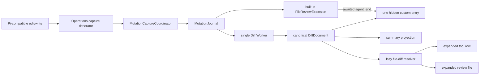

# Changes Review Diff Architecture

本文档描述 Scout 文件变更审查的当前实现。核心原则是：工具执行只提交文件突变事实，`DiffDocument` 是唯一 canonical diff，summary、artifact、聊天内 diff 与完整 panel 都从它单向投影。

## 数据流


```mermaid
flowchart LR
  Tool["Pi-compatible edit/write"] --> Decorator["Operations capture decorator"]
  Decorator --> Capture["MutationCaptureCoordinator"]
  Capture --> Journal["MutationJournal"]
  Journal --> Worker["single Diff Worker"]
  Worker --> Document["canonical DiffDocument"]
  Journal --> Extension["built-in FileReviewExtension"]
  Extension -->|"awaited agent_end"| Entry["one hidden custom entry"]
  Document --> Summary["summary projection"]
  Document --> Entry
  Document --> Resolver["lazy file-diff resolver"]
  Resolver --> Chat["expanded tool row"]
  Resolver --> Panel["expanded review file"]
```

分层职责：

- `extension/core/tools` 保持 Pi 的 edit/write 参数、执行顺序、返回值与错误语义，不包含 Scout UI/review payload。
- `extension/core/review` 是内置 Pi-style extension：装饰 Operations，捕获 before/after snapshot，写入 append-only `MutationJournal`，把 diff 交给单 Worker，并通过 extension hook 投影 tool result 和持久化 artifact。
- `extension/core/agent-session` 只为内置 edit/write 提供 mutation 提交点的窄接入；不拥有 review run、Journal、finalization 或持久化调度。
- `extension/host/review` 只负责 summary、bounded rows 与 syntax tokens 等 host/UI 投影，不参与 review 生命周期。
- `extension/host/protocol` 只按 shared 协议解析 `(sessionId, turnId, fileId, revision)`，不接受任意文件路径。
- `webview` 只保存轻量 identity/status；用户展开文件或工具行时才请求 rows。

## Mutation capture 与提交点

内置 edit/write 依据 tool source identity 装配 capture decorator；同名 extension tool 不会被误捕获。

- edit 的 baseline 复用 Pi edit 本次 `readFile` 的同一 Buffer，没有额外磁盘读取。
- write 通过 snapshot provider 读取 baseline；远程 Operations 没有 provider 时不会回退读取本地磁盘。
- `writeFile` 成功返回是 mutation 提交点。成功写入后即使工具随后报错，Journal 仍记录 `toolOutcome: 'error_after_write'`。
- 同一路径的写入仍由 file mutation queue 串行化。
- snapshot 使用 fatal UTF-8 解码；二进制、非法编码和超限内容以 unavailable metadata 表达，不阻止工具写入。

`MutationJournal` 的聚合键是 owner、turn 与规范化 absolute path。一个 turn 内同一文件的多次写入只保留第一份 baseline 和最后一份 after，并递增 revision；每个工具调用仍保留独立轻量 record，不重复持有 snapshot。

## Canonical DiffDocument

`packages/extension/src/core/review/diff-document.ts` 定义唯一 diff 事实：

```ts
interface DiffDocument {
  version: 1;
  beforeFingerprint?: DiffContentFingerprint;
  afterFingerprint?: DiffContentFingerprint;
  beforeLineCount: number;
  afterLineCount: number;
  additions: number;
  deletions: number;
  firstChangedLine?: number;
  unavailableReason?: DiffDocumentUnavailableReason;
  hunks: DiffHunk[];
}
```

Diff Worker 使用单 Worker、按 owner/turn/file latest-wins 合并待处理 revision。Worker 响应必须同时匹配 fileId 和 revision；旧 revision 的迟到结果直接丢弃。内置 review extension 在 awaited `agent_end` hook 中只封口事件对应的确定 turn，有界等待所有当前 revision 完成，超时 revision 原子降级为 `generation_failed`，同 revision 的迟到响应不能覆盖该 terminal fallback。Host 的 summary 与 lazy row 投影不得重新执行 line diff，也不得读取当前工作区文件来伪造历史上下文。

`DiffDocument` 不保存 syntax tokens。tokens 只在 lazy 请求要求时由 host 生成并进入 bounded LRU。

## Runtime details 与投影事件

工具结果只携带轻量引用：

```ts
interface ScoutFileChangeDetails {
  kind: 'file_change';
  path: string;
  displayPath?: string;
  review: {
    turnId: string;
    recordId: string;
    fileId: string;
    revision: number;
    status: 'pending' | 'ready' | 'unavailable';
  };
  toolOutcome?: 'success' | 'error_after_write';
}
```

它不包含 before/after、rows、tokens 或预测 preview。投影完成时 host 发布 `changes_review_projection_updated`，其中带 session/turn/file/revision/status 与统计。Webview 只对完全相同 identity 的 pending 请求重试，避免旧事件唤醒新 revision。

## Lazy diff 协议

聊天和 changes-review surface 都通过 `request_file_diff` 请求：

```ts
{
  type: 'request_file_diff';
  sessionId: string;
  turnId: string;
  fileId: string;
  revision: number;
  view: 'inline' | 'panel';
  mode: 'unified' | 'split';
  includeTokens: boolean;
  range?: { hunkOffset: number; hunkLimit: number };
}
```

Host resolver 的查找顺序是当前 runtime review，然后是当前 session branch 的 artifact。它校验 session、turn、file 和 revision，不接受 path lookup。响应状态为 `ready`、`pending`、`unavailable` 或 `error`。

边界策略：

- inline：最多 40 rows / 8 hunks。
- panel：最多 2000 rows / 200 hunks。
- Host projection cache 与 token cache 都是 bounded LRU。
- Webview 对相同请求去重并引用计数；最后一个消费者卸载时取消 transport 请求。
- 工具行和 review 文件折叠时不请求 diff；展开后才挂载 lazy hook。
- Panel 分段加载 hunks，避免一次把完整大 diff 挂到 DOM。

## Artifact v2

Artifact v2 只持久化 records、file identity/revision 和 canonical `DiffDocument`。它明确不保存：

- original/modified full content；
- projected rows 或 fold hidden rows；
- syntax tokens；
- 当前磁盘文件内容。

Artifact 必须带 `complete: true`，表示它来自已封口且所有当前 revision 均 terminal 的最终快照。projection 事件只更新 runtime/UI，不触发持久化；内置 extension 在 awaited `agent_end` 中通过标准 `appendEntry()` 为每个 run 追加一次 hidden custom entry，成功后才释放 snapshot。`session_shutdown` 负责重试尚未提交的精确 turn；导出也会先等待同一个 pending flush 边界，避免生成缺少 review artifact 的 JSONL。host 不再维护 debounce、idle scheduler、write tail 或 session 级 finalization 集合。

正常 `agent_end`、abort、replacement、dispose 与 `session_shutdown` 都经过该 awaited 路径；操作系统强杀进程不承诺把尚未到达 hook 的内存态 review 同步落盘。

写入前会校验结构、交叉引用和规模上限。bounded encoder 显式返回 `degraded`；只有完全未降级的 artifact 持久化成功后，才会逐 turn 驱逐 runtime snapshot、record 与 `DiffDocument`，只保留 sealed identity 防止迟到 mutation。若 hunk 因 rows/bytes 限额被折叠，或 files/records 被裁剪，则只释放 snapshot 字符串并保留更完整的 terminal document。只要更完整的 runtime review 仍可用，UI 和 lazy resolver 都优先使用 runtime；artifact 仅在标记完整且 runtime 不可用时作为恢复来源。

只写 v2；v1 通过 `decodeFileReviewArtifact()` 的集中 adapter 只读恢复为内存 v2，旧 rows 会转换成 canonical hunks，旧 tokens 被丢弃。其余生产路径不保留 v1 分支。

## Webview 展示

- 会话中的 completed edit/write 行始终先展示路径与状态。
- 用户展开行后才请求 inline diff；pending 时等待精确 projection event，再重试。
- 完整 Changes Review panel 初始只接收文件摘要和 lazy identity，`rows` 为空。
- 展开文件后请求 panel diff；view mode 只改变 projection/render 方式，不改变 canonical document。
- `file_diff_result` 是 request-scoped response，不写入全局 conversation event store。

## 回归约束

相关测试必须覆盖：

- edit 无额外 baseline read，write provider/fallback 语义与 error-after-write；
- Journal 聚合、turn seal、revision、timeout fallback、迟到 Worker response 与 snapshot release；
- 相邻 run 竞态只封口 `agent_end` 捕获的 turn，多文件 projection 分批完成仍只 append 一个 artifact；
- artifact append 失败保留 snapshot，`session_shutdown` 与导出可重试 pending turn；
- rows/bytes 折叠会标记 artifact degraded，并保留完整 runtime document；
- canonical diff 的 CRLF、create/delete、fold 与单次 diff；
- artifact v2 单次完整写入、v1 decode、规模/引用校验；
- lazy resolver 的 runtime/artifact、pending/stale、range/token/cache；
- Webview 未展开不请求、展开请求、dedupe/cancel、projection event 重试；
- panel model 不含 eager rows，聊天协议不含预测 preview。
