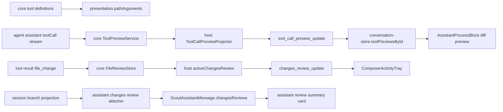

# Changes Review Tool Preview Follow-up

本文记录 2026-07-03 这一轮围绕 Changes Review 的大规模后续工作。上一阶段的 `docs/changes-review-diff.md` 已经说明了如何捕获 `write` / `edit` 产生的文件变更、生成 review diff、持久化 artifact 并打开独立审查面板；这一轮继续补齐“运行中可见性”和“展示语义边界”：

- assistant 流式生成工具调用时，webview 可以提前展示 edit / write 的文件预览。
- assistant 完成后，历史消息可以展示归属于该 assistant turn 的变更审查摘要。
- composer 上方可以展示当前 run 正在产生的 active changes review，和跟进队列共用活动托盘。
- 路径类字段统一区分“业务可定位路径”和“UI 展示路径”，避免 webview 自行推断 cwd-relative path。
- tool preview 从 host projector 中抽到 extension core，host 只做协议适配。

对应提交：

- `629532d feat(shared): :sparkles: 扩展工具预览与变更审查协议`
- `9be9f96 feat(extension): :sparkles: 新增工具调用预览核心服务`
- `2fed8a8 feat(host): :sparkles: 投影工具预览与变更审查摘要`
- `3474035 feat(webview): :sparkles: 展示活动变更审查与工具预览`

## 目标与边界

本轮工作解决三个体验问题。

第一，工具调用处于流式生成阶段时，用户只能看到工具名和原始参数，不能提前判断模型将修改什么。新的 tool preview service 会在 assistant toolCall 参数完整后异步计算文件 diff，并通过 `tool_call_preview_update` 推送到 webview。

第二，完成态 assistant 消息以前依赖 webview 从 tool result 的 `file_change` details 临时聚合变更摘要。这会让展示逻辑承担 host/session 语义，也容易在 runtime content 释放、artifact 恢复、路径规范化后出现不一致。新的设计改为 host 在 session branch 投影时把 `changesReviews` 贴回拥有对应 tool call 的 assistant 消息。

第三，工具参数和 review 数据里有多种 path：用户输入 path、绝对路径、可打开文件的业务 path、cwd-relative 展示 path。新的协议显式增加 `displayPath` / `displayArgs` / `displayArguments`，让 webview 只渲染 host/core 已经投影好的 UI-only 字段。

边界保持 Pi/Scout 分层：

- `shared` 只定义协议字段，不知道如何格式化路径或如何生成 diff。
- `extension/core` 负责工具定义、tool preview 领域服务、review runtime 数据。
- `extension/host` 负责把 core/session 数据投影成 webview 协议、处理 active review 状态和 visible message projection。
- `webview` 只消费 shared 协议字段，展示 composer tray、assistant review summary 和 tool preview diff。

## 总体数据流



## 1. Shared 协议扩展

协议新增集中在 `packages/shared/src`。

### Tool presentation metadata

`ToolInfo` 增加：

```ts
interface ToolPresentationMetadata {
  pathArguments?: readonly string[];
}

interface ToolInfo {
  presentation?: ToolPresentationMetadata;
}
```

该字段声明“哪些工具参数是路径”。它不是 webview 行为配置，而是 host 投影 display arguments 的输入。内置 `read` / `edit` / `write` / `find` / `grep` / `ls` 都声明了 `presentation: { pathArguments: ['path'] }`。

### Display arguments

工具调用相关协议增加展示参数：

```ts
interface ScoutToolCallContent {
  arguments: Record<string, unknown>;
  displayArguments?: Record<string, unknown>;
}

type ScoutAgentEvent =
  | {
      type: 'tool_execution_start';
      args: Record<string, unknown>;
      displayArgs?: Record<string, unknown>;
    }
```

`arguments` / `args` 保留原始业务参数，`displayArguments` / `displayArgs` 只用于 UI 展示。webview 不应该把 display 字段再发回工具或协议请求。

### Changes review summary

新增跨边界 summary 契约：

```ts
interface ScoutChangesReviewSummaryFile {
  path: string;
  displayPath?: string;
  additions: number;
  deletions: number;
}

interface ScoutChangesReviewSummary {
  turnId: string;
  fileCount: number;
  additions: number;
  deletions: number;
  files: ScoutChangesReviewSummaryFile[];
}
```

它同时用于两个位置：

- `ScoutAssistantMessage.changesReviews`：完成态 assistant 历史消息上的 settled review 摘要。
- `ScoutWebviewState.activeChangesReview` 与 `changes_review_update`：当前 run 过程中 composer 活动托盘展示的 review 摘要。

### Path/displayPath 语义

本轮把 review 和 preview 中的路径语义固定下来：

- `path`：业务路径，通常可被 host/core 用于定位文件或标识文件。
- `absolutePath`：明确的文件系统绝对路径，只在需要打开/读取文件的模型里出现。
- `displayPath`：UI-only 展示路径，由 core/host 根据 cwd 生成，通常是 cwd-relative path。

典型字段：

```ts
interface ScoutFileChangeDetails {
  kind: 'file_change';
  path: string;
  displayPath?: string;
}

interface ScoutFileEditPreview {
  kind: 'file_edit';
  path: string;
  displayPath?: string;
}

interface ScoutChangesReviewFile {
  path: string;
  displayPath?: string;
  absolutePath: string;
}
```

这个规则避免了 webview 把绝对路径、用户输入 path、artifact path 混为一谈。

## 2. Extension Core：ToolPreviewService

新增目录：

```text
packages/extension/src/core/tool-preview/
```

核心入口是 `ToolPreviewService`：

- 监听 agent event 中的 assistant `message_start` / `message_update` / `message_end`。
- 只处理 assistant content 中的 `toolCall` block。
- 按 tool name 找到 preview handler。
- 为每个 tool call 维护 `ToolCallPreviewSession`，用于去重、stale 过滤、resource 生命周期。
- 发布 core 层 `ToolPreviewUpdate`，由 host 再映射为 shared event。

### Context key 与 stale 过滤

`ToolPreviewContext` 包含：

```ts
interface ToolPreviewContext {
  generation: number;
  sessionId: string;
  sessionFile?: string;
  cwd: string;
  tools: Partial<Record<string, ToolPreviewToolIdentity>>;
}
```

`DefaultToolPreviewController` 会把 context、tool name、参数 key 合成 request key。异步 diff 计算返回时，必须同时满足：

- 当前 run version 没变。
- 当前 preview context key 没变。
- 当前 tool call session 的 request key 仍然是这次请求。
- write handler 还会检查该请求仍然是 latest request。

这保证了快速流式更新、切换 session、重新开始 agent run 时，旧 diff 不会污染 UI。

### Edit preview

`edit-preview-handler.ts` 做三件事：

1. 解析 tool call 参数，支持结构化 `edits`、JSON 字符串形式的 `edits`，以及旧的 `oldText` / `newText` 参数。
2. 只预览 active builtin edit 工具，避免项目扩展覆盖 `edit` 名称时错误套用内置语义。
3. 调用 `computeEditsDiff(path, edits, cwd)` 生成 diff，并统计 additions / deletions / firstChangedLine。

preview 输出为：

```ts
{
  kind: 'file_edit',
  path,
  displayPath,
  diff,
  additions,
  deletions,
  firstChangedLine,
}
```

### Write preview

`write-preview-handler.ts` 的特殊点是 write 工具会覆盖文件。为了避免实际写入后再读盘造成竞争，本轮新增：

- `captureWriteDiffBase(path, cwd)`：写入前尽早捕获旧内容。
- `computeWriteDiffFromBase(path, content, base)`：基于已捕获 baseline 计算最终 diff。

write preview 在流式阶段会先发布 progress preview：

- 展示目标文件路径。
- additions 先使用待写入内容行数。
- diff 等到 `message_end` 参数稳定后再计算。

如果外部测试或未来实现传入 `computeWritePreview`，handler 也支持直接使用该依赖覆盖默认基线方案。

### text-size 公共化

`MAX_REVIEW_TEXT_BYTES` 和 `getUtf8ByteLength` 从 `review/file-review.ts` 抽到 `core/text-size.ts`。这样 review store 和 edit/write diff preview 都使用同一套文本大小防线。

## 3. Core 工具与 File Review 语义调整

内置工具定义新增 `presentation.pathArguments`，供 host 在 agent event 和 session projection 中生成 display arguments。

`write.ts` / `edit.ts` 的 review payload 改为：

```ts
{
  kind: 'file_review_payload',
  operation: 'write' | 'edit',
  path,          // 工具调用原始 path 参数
  absolutePath,  // 可定位的规范路径
  displayPath,   // cwd-relative UI 展示路径
}
```

`FileReviewStore.addRecord()` 返回的 `ScoutFileChangeDetails` 改为：

```ts
{
  kind: 'file_change',
  path: payload.absolutePath,
  displayPath: payload.displayPath,
  additions,
  deletions,
  review,
}
```

也就是说，tool result details 里的 `path` 现在是可定位路径，不再承担 UI 展示职责。webview 展示时优先使用 `displayPath`。

## 4. Extension Host：协议投影与状态协调

host 侧把 core 领域事件变成 webview 协议，并维护运行态 review summary。

### Display arguments projector

新增 `packages/extension/src/host/protocol/display-arguments.ts`。

它接受原始 args、`formatDisplayPath` 和 `getToolPresentation`，只替换声明为 path argument 的字段：

```ts
createDisplayArguments(args, options, { toolName })
```

如果没有路径字段发生变化，返回 `undefined`，避免协议里出现和原始参数完全相同的冗余 display 字段。

接入点：

- `agent-event-mapper.ts`：转换 assistant `toolCall` content 时生成 `displayArguments`。
- `agent-event-mapper.ts`：转换 `tool_execution_start` 时生成 `displayArgs`。
- `agent-event-correlator.ts`：透传 `formatDisplayPath` / `getToolPresentation`。
- `session-message-projector.ts`：投影历史 session branch 时也使用同一套 mapper。

### ToolCallPreviewProjector 变薄

之前 host projector 里直接解析 edit 参数和计算 diff。现在 `packages/extension/src/host/protocol/tool-call-preview-projector.ts` 只做适配：

- 把 `ScoutAgentEvent` 转成 core `ToolPreviewAgentEvent`。
- 创建 `ToolPreviewService`。
- 把 core `ToolPreviewUpdate` 转成 shared `tool_call_preview_update`。

这样 preview 生命周期、handler 注册、stale 过滤、write baseline 都归 core 负责；host 不再承接工具领域逻辑。

### Active changes review

`ExtensionSessionCoordinator` 新增 `activeChangesReview` 和 `reviewProjectionVersion`。

当 `AgentSession` 通过 `onFileReviewUpdated` 通知 review 更新时：

1. 如果更新来自当前 session，host 用 `createRuntimeChangesReviewSummary(review)` 生成 summary。
2. `setActiveChangesReview(summary)` 更新状态并递增 `reviewProjectionVersion`。
3. host 发送 `changes_review_update` 事件。
4. `StateProtocolService` 的 snapshot 也包含 `activeChangesReview`。

在 `agent_start` / `agent_end` 时会清空 active review，避免上一轮 run 的活动摘要留在 composer 上方。

### Assistant settled changesReviews

新增 `assistant-changes-review-attacher.ts`。

投影 session branch 时，它会：

1. 扫描 assistant message 中的 tool call id。
2. 扫描后续 tool result。
3. 找到 `details.kind === 'file_change'` 且带 `review.turnId` 的 result。
4. 将 turnId 归属到拥有该 tool call 的 assistant message。
5. 调用 resolver 取 `ScoutChangesReviewSummary`。
6. 生成 `assistant.changesReviews`。

resolver 优先使用 runtime review；如果 runtime content 已释放或是恢复后的历史会话，则从当前 branch 的 file review artifact 中生成 summary：

```ts
createRuntimeChangesReviewSummary(review)
createArtifactChangesReviewSummary(artifact)
```

`SessionMessageProjectionCache` 新增 cache key：

- `displayPathKey`
- `reviewProjectionKey`
- `toolPresentationKey`

这样 cwd、tool registry、review artifact 状态变化时不会复用旧投影。

### File review artifact flush scheduler

`FileReviewArtifactFlushScheduler` 从 `session-coordinator.ts` 中抽出，负责：

- session + turn 维度 debounce。
- agent busy/idle 状态判断。
- `flushAllNow()` / `flushOneNow()`。
- dispose 清理 timer。

这让 `ExtensionSessionCoordinator` 保持编排职责，具体 timer/pending map 状态集中在独立类中。

## 5. Webview：状态消费与展示

webview 只消费 shared 事件和状态，不做路径推断或 review summary 聚合。

### conversation store

`conversation-store.ts` 新增 `activeChangesReview` 状态与 `applyChangesReviewUpdate()`。

更新事件只在属于当前 session 时生效：

- `sessionId` 必须匹配。
- 如果 event 带 `sessionFile`，也需要和当前 session file 匹配。
- 同 session 且无 `sessionFile` 的 preview/review update 可以接受，支持运行态尚未落盘的场景。

snapshot 时会接收 `activeChangesReview`。同时，完成态 tool details 是权威数据，因此 store 会在 snapshot 后清理 retained tool previews，避免完成后的 edit/write preview diff 继续显示为完成态细节。

### ComposerActivityTray

新增 `ComposerActivityTray.tsx` 替代旧的 `FollowUpQueuePanel.tsx`。

它统一展示 composer 上方的运行态活动：

- active changes review：文件数、增删统计、审查按钮。
- follow-up queue：保留原有暂停提示、继续、引导、删除行为。

`ChatWorkspace` 从 store 读取 `useActiveChangesReview()`，传入 `ChatComposer`，再传给 `ComposerActivityTray`。

### Assistant changes review summary

`conversation-view-model.ts` 不再从 tool result details 聚合 review summary，而是读取 assistant message 上的 `changesReviews`。

对于最新的 streaming assistant，即使 message 上已经带有 review summary，也会先延迟展示：

```ts
segment.isLatestAssistant && segment.isStreaming ? [] : collectAssistantMessageChangesReviews(...)
```

这样运行中摘要显示在 composer tray，完成后再进入 assistant 消息，避免同一份 review 同时出现在两个位置。

### Tool display 与 preview diff

`AssistantProcessBlock.tsx` 优化了 file edit preview diff：

- 增加 header，展示 title、path、additions、deletions。
- diff 区域支持横向滚动，保留 whitespace，不再强制换行破坏代码对齐。
- preview error 也复用同一 header。
- 完成态 file_change 不再携带 retained preview diff 展开内容；完成后只展示“已编辑/已写入 path”和统计，详细 diff 通过 changes review 面板查看。

工具展示 helpers/presenters 优先使用：

- `displayArguments.path`
- `details.displayPath`
- `preview.displayPath`

只有这些字段缺失时才回退到业务 `path`。

### Changes review surface

`ReviewFileSection.tsx` / `ConversationView.tsx` 展示文件路径时优先使用 `displayPath ?? path`。打开文件或审查请求仍使用业务 path / turnId。

## 6. 关键不变量

### 路径不变量

- core/host 可以用 `path` / `absolutePath` 做定位。
- webview 展示优先用 `displayPath` 或 display args。
- display 字段不参与工具执行、review 聚合、文件打开协议。
- 不要在 webview 中根据 cwd 自行格式化路径；cwd-relative 展示规则属于 host/core。

### Preview 不变量

- tool preview 是运行态辅助显示，不是持久历史。
- preview diff 不应在工具完成后冒充最终 review diff。
- write preview 的旧内容基线必须在写入前捕获。
- preview 只默认支持 active builtin tools；扩展工具如果复用内置名字，不能自动套用内置 preview handler。
- 旧 session、旧 generation、旧参数的异步 preview 结果必须被丢弃。

### Changes review 不变量

- active changes review 属于当前 agent run，显示在 composer tray。
- settled changes review 属于 assistant message，由 host 投影后写入 `ScoutAssistantMessage.changesReviews`。
- runtime review 优先，artifact review 兜底。
- session tree artifact 是持久历史；webview 不直接理解 artifact custom entry。

## 7. 测试覆盖

本轮新增和扩展的关键测试包括：

- `packages/extension/test/core/tool-preview.test.ts`
  - edit/write preview 发布。
  - JSON/legacy 参数解析。
  - stale preview 丢弃。
  - session context 变化丢弃旧结果。
  - extension override builtin tool 时不预览。
  - write baseline 捕获与 progress/final 阶段。
- `packages/extension/test/core/edit-diff.test.ts`
  - write preview baseline 和过大文件防线。
- `packages/extension/test/core/file-review.test.ts`
  - `file_change.path` 可定位、`displayPath` 单独展示。
- `packages/extension/test/host/protocol/assistant-changes-review-attacher.test.ts`
  - assistant tool call 与后续 file_change result 的归属。
- `packages/extension/test/host/review/changes-review-summary-projector.test.ts`
  - runtime/artifact summary 聚合、排序、去重。
- `packages/extension/test/host/protocol/session-message-projector.test.ts`
  - session branch 投影时附加 assistant changesReviews。
- `packages/extension/test/host/protocol/tool-call-preview-projector.test.ts`
  - host projector 改为 core preview service 适配后仍发布协议事件。
- `packages/webview/test/store/conversation-store.test.ts`
  - active changes review snapshot/update。
  - 完成态 snapshot 清理 retained previews。
  - session/sessionFile 过滤。
- `packages/webview/test/conversation/conversation-view.test.tsx`
  - assistant summary 使用 `changesReviews`。
  - streaming 最新 assistant 延迟 settled review 展示。
  - 完成态不再显示 retained preview diff。
  - `displayPath` 展示优先级。
- `packages/webview/test/chat/chat-app.test.tsx`
  - composer activity tray 展示 active changes review 与 queue。

整仓验证：

```bash
pnpm test
```

提交前后均通过：

```text
Test Files  112 passed | 2 skipped (114)
Tests       1256 passed | 44 skipped (1300)
```

## 8. 后续维护建议

新增工具 preview handler 时，应优先放在 `packages/extension/src/core/tool-preview`，让 host projector 继续保持协议适配层职责。handler 需要显式判断工具身份，避免扩展工具覆盖内置名称时误用内置语义。

新增工具参数展示规则时，应在工具定义的 `presentation.pathArguments` 中声明，由 host 统一生成 `displayArguments`。不要在 webview 的 presenter/helper 中硬编码某个工具的路径参数名。

新增 review 展示入口时，应优先消费 `ScoutChangesReviewSummary`。如果需要更完整的 diff 内容，应该通过现有 `open_changes_review` 请求打开 review surface，而不是把 artifact 或 runtime review 结构下沉到 webview。

修改 session projection cache 时，需要同步考虑三类 key：

- 路径展示规则是否变化。
- review artifact/runtime summary 是否变化。
- tool registry presentation metadata 是否变化。

修改完成态工具展示时，要保留“tool result details 是权威完成态数据”这一语义。preview 只是流式运行态提示，不能在完成后继续充当最终 diff 来源。
