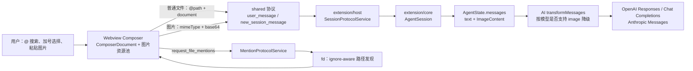

# Composer 文件引用、图片附件与文件搜索

本文基于当前 Scout 实现整理 Composer 中“文件 / 文件夹 / 图片”能力的完整链路：它们如何进入模型 query，上下文和会话如何保存，Webview 如何展示，以及 `@` 文件搜索怎样工作。

最重要的结论是：**普通文件不是上传给模型的附件；图片才是。**

- 普通文件或文件夹会变成原子化的 `@路径` 文本引用。模型只得到路径，是否读取内容由它随后调用 `read`、`find` 等工具决定。
- 图片会作为 `ImageContent`（MIME + base64）加入用户消息，随后被转换为 OpenAI 或 Anthropic 的多模态请求块。
- `ScoutComposerDocument` 记录的是文件引用的结构化展示元数据；它会随 session 保存、供 Webview 恢复标签，但**不参与 provider/runtime context**。

## 1. 概念与数据边界

| 类型 | Composer 中的形态 | 进入 Agent/模型的形态 | 会话持久化 | Webview 展示 |
| --- | --- | --- | --- | --- |
| 文本 | 普通文本 segment | `text` block | `message.content` | 用户消息气泡 |
| 文件 | 原子 `file` reference | 格式化为 `@path` / `@"path with spaces"` 的文本 | `message.content` 保存格式化文本；`details` 保存结构化 document | 文件图标标签，可点击打开 |
| 文件夹 | 原子 `fileKind: directory` reference | 格式化为 `@path` 文本 | 同上 | 文件夹图标标签；不可直接打开 |
| 图片 | 内存中的 `File` + descriptor | `ImageContent { type, mimeType, data(base64) }` | base64 位于 `message.content`，会写进 JSONL | 待发送缩略图、历史缩略图、全屏预览和下载 |

`shared` 层的跨边界契约位于 `packages/shared/src/protocol-core.ts`、`protocol-state.ts`、`protocol-requests.ts`：

```ts
interface ScoutComposerDocument {
  segments: Array<
    | { type: 'text'; text: string }
    | { type: 'reference'; reference: ScoutComposerFileReference | ScoutComposerSkillReference }
  >;
}

interface ScoutComposerFileReference {
  id: string;
  kind: 'file';
  fileKind: 'file' | 'directory';
  path: string;
  label: string;
}

interface ScoutImageContent {
  type: 'image';
  mimeType: string;
  data: string; // base64，不含 data: URL 前缀
}
```

`File`、`Blob`、object URL 和 Lexical node 都不会穿过协议。它们只存在于 Webview 内部，避免把浏览器对象泄露到 extension/host 或 session。

## 2. 全链路总览



这张图中的 `document` 与 `text` 不能混淆：`document` 是 UI 的结构化投影；真正发给 Agent 的是由 document 格式化后的 `text`。

## 3. 普通文件与文件夹：引用而非内容注入

### 3.1 输入模型和原子引用

Composer 使用 `ComposerDocument` 作为业务模型，Lexical 只是编辑器实现。文件引用在线性编辑坐标中占用一个 `U+FFFC` 占位符，因此可被整体插入、选择和删除，不能拆成残缺路径。

`formatComposerSubmitText()` 会在提交前依次展开 segment：

```text
请检查 <file reference src/main.ts> 并修复
        ↓
请检查 @src/main.ts 并修复

检查 <file reference My Folder/a.ts>
        ↓
检查 @"My Folder/a.ts"
```

这里的标签 `label` 仅用于显示；进入文本的是 `path`。文件夹也采用相同的 `@path` 文本形式。

### 3.2 提交、runtime context 与持久化

当前会话发送 `user_message`，新会话发送 `new_session_message`。两种 payload 都可同时携带：

```ts
{
  type: 'user_message',
  text: '检查 @packages/agent/src/agent.ts',
  document: { segments: [...] },
  images: [...]
}
```

host 的 `SessionProtocolService` 将 text、document 和 images 交给 `ExtensionSessionCoordinator`；`AgentSession.createUserMessage()` 最终创建：

```ts
{
  role: 'user',
  content: [{ type: 'text', text }, ...images],
  timestamp
}
```

同一条 user message 的 `document` 被保存在 `SessionMessageEntry.details`：

- `details` 经 `WeakMap` 关联到运行中的 Agent message，消息结束持久化时写入 session JSONL。
- `buildSessionContext()` 只读取 `entry.message`，完全忽略 `entry.details`；因此 document 不会被误发送给 provider。
- restore、导航和 compaction 后重建 runtime 时，provider 仍只接收 `message.content` 中的 `@path` 文本；Webview 投影则能从 details 恢复文件标签。

因此“引用文件”不意味着文件内容已在 query 中。模型需要根据 `@path` 调用工具去读，工具的读取结果才会在后续 turn 作为 `toolResult` 进入上下文。这种策略避免一次引用就把大文件或目录树无条件塞进 token window，也保留模型选择读取范围、offset 和时机的能力。

### 3.3 文件选择器分类规则

点击加号菜单的“文件 / 图片”会调用 host 的 `pick_composer_content`，由 VS Code `showOpenDialog` 选择多个文件；“文件夹”使用单选目录选择器。

对每个选中的文件，host 按下面的顺序分类：

1. 目录直接产生 `directory` 引用。
2. 扩展名不属于 `.gif/.jpeg/.jpg/.png/.webp`，产生普通 `file` 引用，不读取文件内容。
3. 候选图片先检查 `stat.size <= 2 MiB`，再读 bytes，并再次检查实际读取长度，防止选择后文件变大。
4. 对 bytes 做文件头嗅探，支持 JPEG、非 APNG 的 PNG、GIF 和 WebP。
5. 嗅探成功则转换为 base64 图片；嗅探失败则退回为普通文件引用，并报告“不是受支持的图片内容”。

当前 session 的 cwd 内文件会存为 cwd-relative、统一 `/` 分隔的路径；从 cwd 外选择的文件保留绝对路径。这样模型拿到的是可执行的路径语义，而搜索结果始终是项目 cwd 内的相对路径。

## 4. 图片：真正的多模态上下文

### 4.1 接入入口和前端校验

图片有两条入口：

- 通过 host 文件选择器选择：host 先完成 MIME 嗅探和大小检查，返回 base64；Webview 再重建为 `File`，纳入统一图片流程。
- 在输入框粘贴：Webview 从 clipboard 的 `DataTransferItem` / `files` 获取 `File`，本地校验后加入草稿。

Webview 的 `selectComposerImageFiles()` 统一施加以下限制：

| 规则 | 当前值/行为 |
| --- | --- |
| 允许 MIME | `image/jpeg`、`image/png`、`image/gif`、`image/webp`；`image/jpg` 规范化为 JPEG |
| 单图上限 | 2 MiB（`SCOUT_COMPOSER_IMAGE_MAX_BYTES`） |
| 单条消息上限 | 6 张（`SCOUT_COMPOSER_IMAGE_MAX_COUNT`） |
| 动图 | Webview 检测并拒绝多帧 GIF/WebP；host 嗅探会拒绝 APNG |
| 失败处理 | 忽略不合格图片并显示 warning；有效文件引用不会因同批图片失败而回滚 |

图片草稿只保存轻量 descriptor（id、MIME、文件名、大小）；真正的 `File` 与 object URL 放在模块级 `composer-image-registry`。资源池引用计数覆盖草稿暂存、恢复、发送失败和删除，最后一个引用释放时调用 `URL.revokeObjectURL()`。

### 4.2 发送时编码与会话存储

提交阶段才由 `FileReader.readAsDataURL()` 将每张图片编码为 base64，并移除 data URL 前缀，形成 `ScoutImageContent`。所有图片读取必须成功；任一编码失败会中止本次发送并保留/提示用户重新选择，避免只发出“部分附件”。

图片随后经历：

```text
File / base64 picker result
  → Composer descriptor + object URL（仅 Webview 内存）
  → submit 时 ScoutImageContent（跨 postMessage）
  → Agent user content: [text, image, ...]
  → SessionMessageEntry.message（JSONL 持久化 base64）
  → provider 请求图像块
```

所以图片会写入本地 session JSONL，导出 session 时也会被带出；同时会发给模型服务。它不能被当作仅用于本地预览的临时资源。

### 4.3 模型能力与 provider 请求映射

AI 层先执行 `transformMessages()`：若目标模型 `model.input` 不包含 `image`，用户图片不会删除持久化记录，而会在本次 provider 请求中替换为：

```text
(image omitted: model does not support images)
```

连续图片占位符会合并，避免重复噪声。支持视觉输入的模型按 API 转换：

| API | 文本块 | 图片块 |
| --- | --- | --- |
| OpenAI Responses | `input_text` | `input_image`，`image_url: data:<mime>;base64,<data>`，`detail: 'auto'` |
| OpenAI Chat Completions | `text` | `image_url`，同样使用 data URL |
| Anthropic Messages | `text` | `image`，`source: { type: 'base64', media_type, data }` |

工具结果中若也包含图片，三套 adapter 各自遵守 API 限制：Chat Completions 会把图片拆到额外 user image message；Responses 可写入 function-call output 的多模态 content；Anthropic 使用 `tool_result` 的内容块。Composer 图片和工具读图的共同抽象都是 `ImageContent`，但来源不同。

### 4.4 上下文预算与压缩限制

context token 的本地估算为每张图片按 4,800 字符、约 1,200 token 计。这个估算只用于没有最新 provider usage 时的保守决策，不能替代供应商最终计费。

需要特别注意：compaction / branch summary 在 `serializeConversation()` 中只序列化 user 的 text block，**不序列化图片**。被压缩的早期图片不一定有文字描述留在 summary 中；只有 compaction 切点之后保留的原始消息仍能把图像发给后续模型。因此关键图片应配合文字说明，或者在后续 turn 明确重新引用/重新附图。

## 5. 前端展示策略

### 5.1 Composer 内

- 文件和文件夹使用 `InlineResourceReference`：文件显示 File 图标，文件夹显示 Folder 图标，标签长文本截断。
- 文件标签可点击，经 `open_mentioned_file` 让 VS Code 打开；文件夹没有错误的“打开文本文件”动作。
- 选择器打开期间编辑内容发生变化时，不会复用旧 range；引用会插入最新光标位置，避免异步返回覆盖用户新输入。
- 图片在输入框上方以水平滚动的 80px 缩略图 tray 展示；每张图有预览和移除操作。
- 预览使用 object URL，不提前 base64 编码；全屏预览支持上一张/下一张、左右键、50%–300% 缩放、下载。

### 5.2 已发送消息

host 的 `agent-event-mapper` 将 user message 映射为 shared `ScoutMessage`：

- 若 session entry 有合法 `details` document，映射为 `composerDocument` content block，再附加其中的 image blocks。
- 若没有 document（旧会话或非 Composer 输入），回退展示原始 text/image 内容。

`ConversationTranscript` 把这两类内容分开：文件/文件夹标签与文本放在右侧用户气泡中；图片放在气泡上方、右对齐的横向缩略图 tray。历史图片重建为 `data:<mime>;base64,...` URL，而不是依赖已失效的 composer object URL。点击后使用同一套预览框，下载操作通过 host 的保存对话框写成二进制文件。

这使“展示名称”和“模型 prompt”可以不同：用户看见 `main.tsx` 的标签，模型看到 `@packages/webview/src/main.tsx`；用户看到缩略图，模型得到 MIME + base64 图像内容。

## 6. `@` 文件搜索

### 6.1 Webview 触发与交互

`getFileMentionTrigger()` 只在词边界处识别 `@`：

- `@`：打开“文件 / 图片”“文件夹”添加菜单。
- `@agent`：打开项目文件搜索。
- `@"My Folder/file.ts"`：支持含空格的带引号路径；选中结果时会替换整个 token，并消费已有右引号。
- `email@agent`、已离开 token 的 `@agent next` 不触发；光标移动出 token 后菜单关闭。

非空 query 通过 `useFileMentionSearch()` 在 120 ms 防抖后请求：

```ts
{ type: 'request_file_mentions', query, limit: 50 }
```

query 改变、触发关闭或组件卸载时会取消上一条 transport request。响应还会与当前 query 比较，避免已取消请求的迟到结果污染新菜单。UI 分为“搜索中”“无结果”“错误”和 listbox 四种状态；列表支持鼠标、上下键和 Enter。没有候选（包含仍在 loading）时按 Enter 不会强制选择，而是正常提交用户输入的字面 `@...` 文本。

### 6.2 Host 侧发现算法

`MentionProtocolService` 在首次组装 host services 时通过 `ensureTool('fd')` 准备 `fd`。准备失败时搜索返回可见错误“fd 未安装且自动下载失败”，而不是把“不可用”伪装成空结果。

对每次搜索：

1. 使用**当前活动 session 的 cwd**；切换/恢复 session 后下一次请求会自动换根目录。
2. 限制请求上限为 1–100；Webview 的 50 条会先扩大为 200 个候选（4 倍）交给 `fd`。
3. 使用 `fd` 参数：`--hidden`、`--no-require-git`、`--full-path`、`--ignore-case`、`--color=never`、`--max-results`。
4. 固定排除 `.git`、`.hg`、`.svn`、`.scout`、`node_modules`、`dist`、`out`；其他 ignore 规则仍由 `fd` 统一处理。
5. 将用户 query 转为字面量正则：特殊正则字符会转义，路径 `/` 会变成可兼容 `/` 和 `\\` 的分隔符表达式。因此它是路径匹配，不是任意正则执行入口。
6. 不传 `--follow`，不会跟随目录符号链接离开 cwd。
7. stdout 路径会规范化为 cwd-relative `/` 路径；解析后再次过滤空路径和 `../` 越界候选，`stat` 区分文件与目录。
8. 最终按“目录优先、路径字典序”稳定排序，再截取用户所请求的上限。

取消请求会 kill `fd` 子进程并且不返回结果；真正的执行错误会被映射为“文件搜索失败，请重试”，详细原因只写入 extension 日志。搜索过程只读取路径和 `stat`，不会读取任何候选文件的文本/二进制内容。

## 7. 与 Pi CLI `@file` 的差异

Pi 的 CLI `file-processor.ts` 对启动参数 `@file` 使用另一种语义：普通文本文件会被读出并包成 `<file name="...">内容</file>` 直接拼进初始 prompt；图片会读取、可选自动 resize 后作为图像附件，同时添加 `<file>` 说明。

Scout 当前 Composer 的文件引用没有采用这个“自动内容注入”策略：

| 场景 | Pi CLI `@file` | Scout Composer `@文件` |
| --- | --- | --- |
| 文本文件 | 读取全文并进入首个 prompt | 仅把路径文本放入 prompt，由模型自行读 |
| 文件夹 | CLI 参数不等同于目录上下文 | 仅目录路径引用 |
| 图片 | 可自动 resize 后作为附件 | 2 MiB / 6 张固定上限，无 resize，作为附件 |
| 目的 | 非交互 CLI 初始输入 | IDE 会话中的可控、按需读取 |

这是 Scout 当前实现与 Pi CLI 的明确行为差异，而不是同一输入格式的两个等价实现。若要向 Pi 的“内容注入”语义对齐，需要先定义大小/编码/二进制/目录/隐私与 token 上限，再新增明确的引用种类或提交策略；不应把现有 `file` reference 悄悄改成隐式全量读取。

## 8. 现有边界与后续决策点

1. **host 协议校验只验证图片对象形状**。2 MiB、6 张和动画限制由 picker/Webview 正常路径执行；若把 Webview 当作不可信边界，需要在 host 的 `user_message` / `new_session_message` guard 再做数量、MIME、base64 大小和内容嗅探校验。
2. **早期图片在 compaction 后没有视觉摘要**。关键图片必须有文本描述；否则摘要后的后续模型缺少图像事实。
3. **浏览器粘贴路径与 host picker 的格式验证不完全相同**。host 会拒绝 APNG，Webview 目前专门检测 GIF/WebP 动画；若要保证所有入口一致，应把图片解析/动画检测收敛为共享策略或 host 复验。
4. **外部路径是显式允许的**。文件选择器会保留 cwd 外绝对路径，打开操作也可解析绝对路径；文件搜索本身仍严格限定在当前 cwd。产品层需要继续明确这是否符合工作区边界与权限模型。
5. **没有自动读取引用文件**。这降低无意 token 消耗，但结果质量依赖模型正确调用读取工具；若某类工作流要求确定性上下文，应设计显式“读取并附加摘要/内容”的用户动作。

## 9. 关键实现与回归覆盖

| 关注点 | 主要实现 | 代表性测试 |
| --- | --- | --- |
| Shared 契约 | `packages/shared/src/protocol-*.ts` | 协议 route/guard 测试 |
| 文件 picker、图片分类、打开文件 | `packages/extension/src/host/protocol/services/mention-service.ts` | `packages/extension/test/host/protocol/services/mention-service.test.ts` |
| fd 搜索与候选投影 | `file-mention-discovery.ts` | `file-mention-discovery.test.ts` |
| 文件引用编辑模型 | `packages/webview/src/store/composer-document.ts` | `composer-document.test.ts` |
| `@` 触发与菜单 | `features/composer/model/file-mention-trigger.ts`、`hooks/use-file-mention-*.ts` | `file-mention-trigger.test.ts`、`file-mention-menu.test.tsx` |
| 图片校验、编码与资源生命周期 | `features/composer/model/composer-images.ts`、`store/composer-image-registry.ts` | `composer-image-registry.test.ts`、chat composer 图片用例 |
| 历史消息展示 | `ConversationTranscript.tsx`、`user-message-image-adapter.ts` | conversation/chat 测试 |
| 进入 Agent、session details | `SessionProtocolService`、`AgentSession`、`session-manager.ts` | session service / agent session / message projector 测试 |
| provider 多模态转换 | `packages/ai/src/providers/*.ts` | `packages/ai/test/providers/transform-messages.test.ts` 与各 provider 测试 |

本文为实现整理文档，未新增或执行测试。
