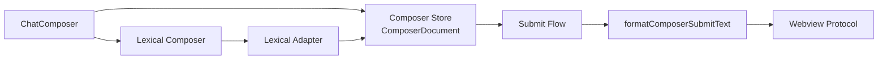

# Webview 输入区原子技能引用

本文档对应提交 `36cd3f52b9d36c2c6775b74324f6bdfffd7ff987`（`feat(webview): :sparkles: 支持输入区原子技能引用`），说明 Webview 输入区从纯文本 `textarea` 升级为结构化编辑器后的设计与行为。

## 目标

- 在输入区选择 Skill 类型的斜杠命令后，以不可拆分的行内引用展示，而不是回填普通文本。
- 保持既有的草稿隔离、图片附件、新会话暂存、追问与中断提交流程。
- 让编辑器实现可以替换，业务状态和提交格式不绑定 Lexical 的节点结构。

当前仅启用技能引用：选择 `/skill-name` 后会插入一个 `skill` 引用节点。`file` 引用已包含在文档模型中，作为后续 `@` 文件提及功能的契约预留；本次提交没有提供文件搜索、选择或插入入口。

## 用户可见行为

1. 在输入区键入 `/` 并选择来源为 `skill` 的命令，会用原子标签替换当前斜杠触发词。
2. 该标签在编辑器中是一个整体；光标相邻时按 Backspace 或 Delete 会一次删除整个引用，不能把它编辑成残缺文本。
3. 含有引用、但没有普通文字和图片的草稿仍可提交。
4. 提交前引用会转为模型可读文本：技能引用格式为 `/命令名`，文件引用格式为 `@路径`。因此 Extension/Webview 协议不需要认识 Lexical 节点。
5. 通过协议替换输入内容、选择斜杠菜单项后，光标会落在替换位置；鼠标焦点和键盘焦点的轮廓样式与原输入区一致。

## 分层与状态模型



`ComposerDocument` 位于 `packages/webview/src/store/composer-document.ts`，是输入内容的唯一业务表示：

```ts
interface ComposerDocument {
  segments: Array<
    | { type: 'text'; text: string }
    | { type: 'reference'; reference: ComposerReference }
  >;
}
```

- 文本和引用按顺序保存在 `segments` 中；相邻文本会在规范化时合并，空文本会移除。
- 引用在线性坐标中占用一个 `U+FFFC` 字符位置。这让斜杠触发词替换、选区定位和原子删除可以共享同一套偏移计算。
- `composer-store` 以会话 id 存储 `ComposerDocument`、图片和待恢复草稿。`setText` 仍保留为兼容现有命令 effect 的适配方法，但内部会转换成纯文本文档。
- 暂存、恢复和清理草稿时都会克隆或规范化文档，避免外部对象引用直接修改 store 状态。

Lexical 仅是视图编辑器：

- `ComposerReferenceNode` 把引用表示为 Lexical `DecoratorNode`，负责原子、行内、可键盘选择的编辑器语义与标签渲染。
- `composer-lexical-adapter.ts` 在 Lexical 树和 `ComposerDocument` 之间双向转换，并负责线性偏移与选区定位。
- `ComposerDocumentPlugin` 处理 store → 编辑器同步、编辑器 → store 同步，以及聚焦和范围替换等命令式能力。
- `ComposerAtomicReferenceDeletionPlugin` 拦截相邻引用的 Backspace/Delete，确保引用作为整体删除。

这种边界使后续新增引用类型或替换编辑器时，不会影响草稿、提交或协议层。

## 提交流程与既有语义

`use-composer-submit-flow.ts` 以 `ComposerDocument` 替代旧的 `text` 字段判断草稿和构造提交负载：

- 普通可见文字由 `getComposerPlainText` 判断。
- `hasComposerReferences` 保证“只有原子引用”的内容不会被当作空草稿丢弃。
- 图片上传、lease 管理、当前会话提交、新会话暂存、追问和 steer 的选择逻辑不变。
- 发送给 `protocolClient` 前统一调用 `formatComposerSubmitText` 展开引用，继续传递字符串消息和图片列表，保持现有 shared 协议稳定。

## UI 与可访问性

- 原 `Textarea` 替换为 Lexical 的 `ContentEditable`，保持 `textbox`、`aria-multiline`、`aria-readonly` 与 placeholder 语义。
- 斜杠菜单快捷键事件改为面向 `HTMLDivElement` 的事件类型；已处理的键盘事件会同时停止 React 和原生冒泡，避免编辑器继续执行默认操作。
- 指针聚焦仍可隐藏焦点轮廓；失焦时通过 `clearFocusOutlineSuppression` 无条件清理该标记，覆盖点击不可聚焦区域时 `relatedTarget === null` 的场景，避免下一次键盘聚焦丢失轮廓。

## 构建影响

新增依赖 `lexical` 与 `@lexical/react`。Vite 的 `manualChunks` 会优先将它们拆到 `vendor-editor`，避免被通用 React 分组规则吸收：

- 减小通用 vendor chunk，保持编辑器依赖边界清晰。
- 当前 `ChatApp` 仍为静态导入，因此初始页面仍会预加载该 chunk；此拆分主要改善缓存边界和构建产物组织，并不等同于延迟加载编辑器。

若后续需要让设置页或树视图完全避开 Lexical 的下载，应在应用入口按界面或路由懒加载 `ChatApp`，并评估首屏加载与切换时机。

## 回归覆盖

本次改动新增或更新了以下覆盖范围：

- `test/composer/composer-document.test.ts`：文档规范化、线性文本、范围替换与引用去重语义。
- `test/composer/composer-submit.test.ts`：引用展开、仅引用提交和图片组合提交。
- `test/composer/chat-composer-prefill.test.tsx`、`test/chat/chat-app.test.tsx`：草稿、预填、菜单选择和组件交互。
- `test/bridge/extension-message-router.test.ts`：来自 Extension 的输入替换仍能写入结构化草稿。
- `test/styles/webview-style-smoke.test.ts` 与 `test/setup.ts`：焦点轮廓清理和 Lexical DOM 测试环境。

提交前已通过 `pnpm -C packages/webview check-types`、`pnpm -C packages/webview test`（45 个测试文件、414 个测试）和 Webview lint；lint 仅保留 `components/ui/button.tsx` 中已有的 Fast Refresh warning。
