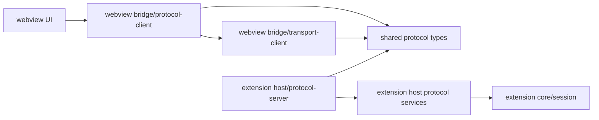

# Webview Protocol Boundary

本文档描述 Scout 的 Webview 与 Extension 通信边界。核心原则：`requestId` 是 transport envelope 的 correlation/cancellation id，不是业务请求字段。

## 分层职责



- `packages/shared/src/index.ts` 只定义跨边界消息契约，不保存业务状态，不引入 extension/webview 内部类型。
- `packages/webview/src/bridge/protocol-client.ts` 是业务组件调用入口，组件只表达用户意图。
- `packages/shared/src/index.ts` 的 `SCOUT_PROTOCOL` 是 payload type 到 `service/method` 的权威路由表，用完整 `Record` 防止新增协议时漏 route。
- `packages/webview/src/bridge/protocol-route.ts` 只负责从 shared `SCOUT_PROTOCOL` 读取路由，不维护第二套路由事实。
- `packages/webview/src/bridge/transport-client.ts` 负责生成 `requestId`、发送 envelope、按 `requestId` 分发响应、发取消消息。
- `packages/extension/src/host/protocol/protocol-server.ts` 负责按 `service/method` 分发 handler、回填同一个 `requestId`、处理 cancel。
- `packages/extension/src/host/protocol/protocol-bus.ts` 负责校验 `service/method` 与 shared 路由声明一致，并按 `surfaces` 白名单拒绝错误 surface 的请求。
- `packages/extension/src/host/protocol/request-registry.ts` 只追踪协议请求生命周期、cleanup 和 streaming sequence。
- `packages/extension/src/host/protocol/services/*` 负责协议 payload 到 host/core 能力的适配；不要把 VS Code postMessage envelope 继续下沉。

## Envelope 与 Payload

Webview 发出的消息分两层：

```ts
{
  type: 'protocol_request',
  requestId,
  service,
  method,
  payload,
  streaming,
}
```

- `requestId`、`service`、`method`、`streaming` 属于 transport envelope。
- `payload` 是业务协议，如 `{ type: 'select_model', provider, modelId }`。
- 业务 payload 不应该包含 `requestId`。例如 `UpdateSettingsRequest`、`ToggleMcpServerRequest`、`request_task_history` 这类 payload 都不承担 correlation。
- Extension response 必须带同一个 `requestId`，webview transport 只把匹配的 response 交给对应 callback。
- Cancel 只通过 `{ type: 'protocol_cancel', requestId }` 表达，Extension 使用 request registry 执行 cleanup。

## requestId 与 UI Token

`requestId` 只用于 Webview 和 Extension transport 之间的 correlation/cancellation。普通业务逻辑、agent、handler、session tree 都不需要知道它。

如果 Webview UI 自己需要过滤过期结果，应使用独立 UI token。当前任务历史面板使用 `history:*` query token，它只在 webview store 内判断响应是否过期，不参与 Extension 协议取消和回包关联。

## 新增协议 Checklist

1. 在 `packages/shared/src/index.ts` 增加新的 `WebviewRequestPayload`、response/event 类型，并同步 `SCOUT_PROTOCOL` 的 `service/method`、`response`、`emits`、`surfaces`。
2. 确认 `packages/webview/src/bridge/protocol-route.ts` 能从 `SCOUT_PROTOCOL` 解析新 payload，不要在 Webview 维护第二套路由表。
3. 在 `packages/extension/src/host/protocol/services/*` 注册对应 handler，必要时新增 service host 方法。
4. 如果请求需要单次响应，在 webview `protocol-client` 使用 `sendRouted` 或 `sendProtocolRequest` 的 `onResponse`。
5. 如果请求需要取消或长生命周期，使用 transport 的 `requestId` 和 Extension `ProtocolRequestRegistry`，不要把 id 放进业务 payload。
6. 更新测试：
   - `packages/webview/test/bridge/protocol-route.test.ts`
   - `packages/webview/test/bridge/transport-client.test.ts`，如果 transport 行为变化
   - `packages/extension/test/host/protocol/protocol-registration.test.ts`
   - 对应 service 单元测试

## 性能与可维护性收益

- Request-scoped response 避免把结果广播给所有 webview surface。
- Task/session 查询通过 `SessionIndex` 缓存与 in-flight dedupe 减少重复扫描。
- Cancel 能尽早清理 pending callback、abort signal 和 streaming cleanup。
- 显式 route 表和注册完整性测试把协议漂移提前到类型检查和单测阶段。
